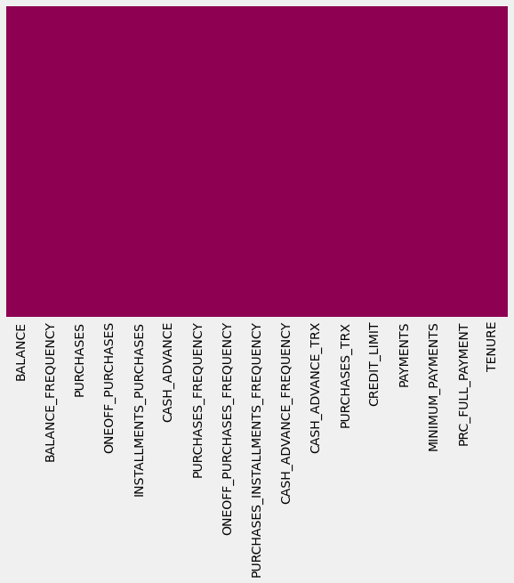
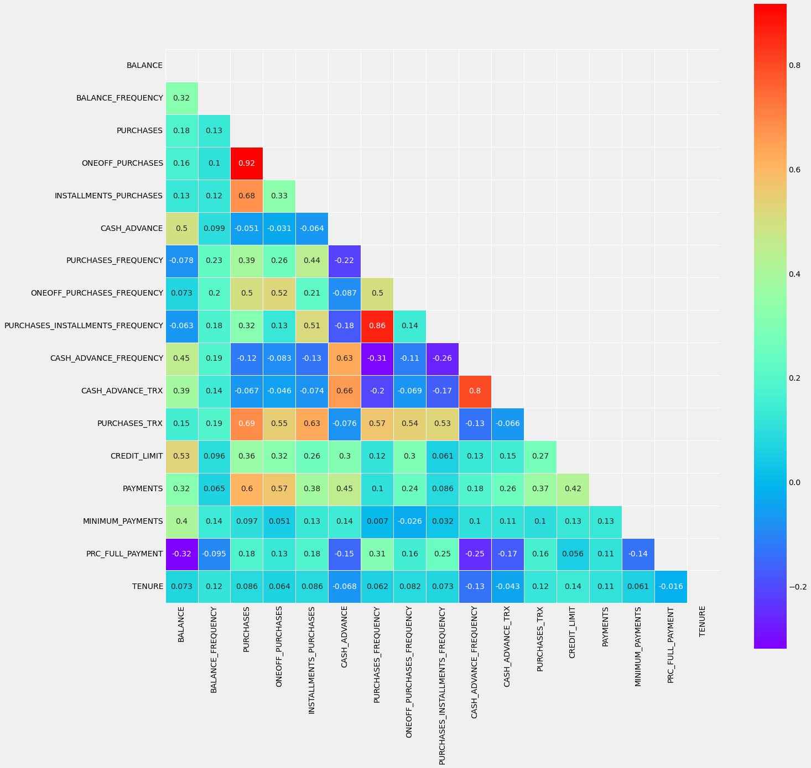
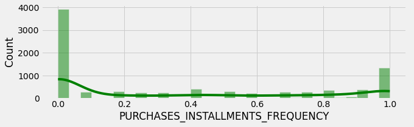
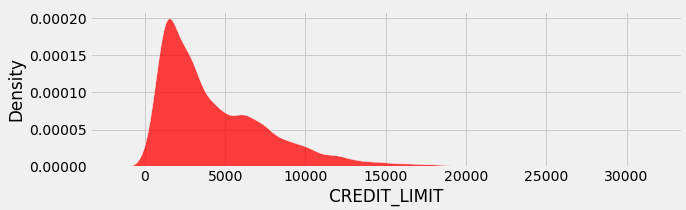
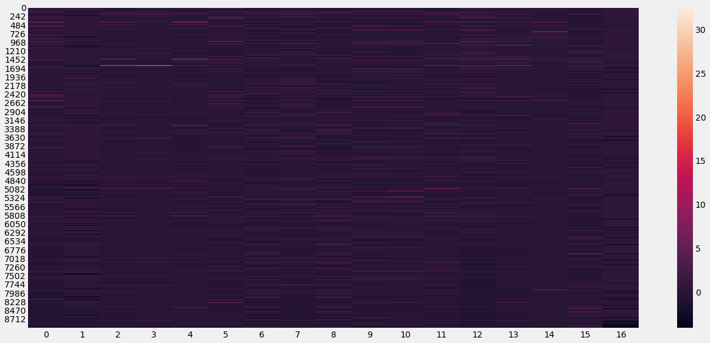
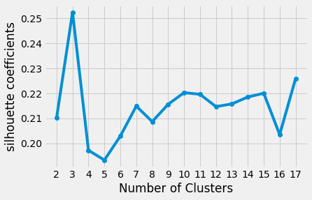

# Machine_learning_clustering_Credit_Card_Customer
Cluster analysis is a machine learning approach that involves grouping unlabelled data based on shared characteristics. Essentially, it involves dividing a dataset into clusters of data points that are similar to each other, while being dissimilar to those in other clusters.
To accomplish this, the algorithm seeks out patterns within the unlabelled dataset, such as shape, size, color, or behavior, and then groups data points based on the presence or absence of those patterns. Unlike supervised learning methods, cluster analysis is an unsupervised technique that doesn't require labeled data. Once the algorithm has completed the clustering process, each group is assigned a unique cluster ID, which can be used to simplify the processing of large and complex datasets by the machine learning system.

I have used threes approaches of clustering method on the data of credit card. The steps of the works are as follows:

I check and rectify the missing values in the dataset:

The correlations between the parameters of the dataset is analyzed:

The histograms of two parameters of the dataset have been visualized.

The dataset has been scaled:

Now, we are able to apply the clustering methods. 

In data mining, the K-means algorithm is utilized to handle learning data. Initially, a set of random centroids is selected and assigned to each cluster. The algorithm then iteratively performs calculations to optimize the positions of the centroids until they become stable or a defined number of iterations is reached. At this point, the creation and optimization of clusters stop, indicating a successful clustering process.
Important step is to determine the number of clusters. I used Silhouette Coefficient.

3 clusters were chosen based on silhouette analysis. 

Clustering results by K-mean between two variables:

